# OCR HTTP POST API Documentation

## Endpoint
- URL: `/ocr`
- Method: POST

NOTE: We use http instead of https for demonstration purposes. In production, we'll use https.

## Description
This API endpoint performs OCR (Optical Character Recognition) on provided images and returns container information.

## Request Parameters
- `mode` (integer, required): Specifies the mode of OCR processing. Valid values are 1, and 2.
- `Image1` to `Image8` (string, optional): Base64-encoded image data. The number of image parameters depends on the selected mode.
  - For mode 0 and 1, provide `Image1` to `Image6`.
  - For mode 2, provide `Image1` to `Image8`.

## Request Example
```json
{
  "mode": 1,
  "Image1": "base64-encoded-image-data-1",
  "Image2": "base64-encoded-image-data-2",
  "Image3": "base64-encoded-image-data-3",
  "Image4": "base64-encoded-image-data-4",
  "Image5": "base64-encoded-image-data-5",
  "Image6": "base64-encoded-image-data-6"
}
```

## Response Parameters
- `ContainerCount` (integer): The number of containers detected in the images.
- `LeftContainerNo` (string): The container number of the left container.
- `LeftContainerType` (string): The type of the left container.
- `LeftContainerDamaged` (string): Indicates if the left container is damaged.
- `LeftContainerHasDoor` (boolean): Indicates if the left container has a door.
- `LeftContainerIsDangerousGoods` (boolean): Indicates if the left container contains dangerous goods.
- `LeftContainerIsSealed` (boolean): Indicates if the left container is sealed.
- `RightContainerNo` (string): The container number of the right container.
- `RightContainerType` (string): The type of the right container.
- `RightContainerDamaged` (string): Indicates if the right container is damaged.
- `RightContainerHasDoor` (boolean): Indicates if the right container has a door.
- `RightContainerIsDangerousGoods` (boolean): Indicates if the right container contains dangerous goods.
- `RightContainerIsSealed` (boolean): Indicates if the right container is sealed.

## Response Example
```json
{
  "ContainerCount": 2,
  "LeftContainerNo": "MSMU1015167",
  "LeftContainerType": "22G1",
  "LeftContainerDamaged": "",
  "LeftContainerHasDoor": true,
  "LeftContainerIsDangerousGoods": false,
  "LeftContainerIsSealed": false,
  "RightContainerNo": "TCLU2664347",
  "RightContainerType": "22G1",
  "RightContainerDamaged": "",
  "RightContainerHasDoor": false,
  "RightContainerIsDangerousGoods": false,
  "RightContainerIsSealed": false
}
```

## Example Usage
```python
import requests
import base64
import json

REQ_URL = 'http://ip:port/ocr'

def test_ocr_middleware(mode, image_paths):
    # Prepare the request data
    data = {'mode': mode}
    for i, path in enumerate(image_paths, start=1):
        with open(path, 'rb') as file:
            image_data = base64.b64encode(file.read()).decode('utf-8')
            data[f'Image{i}'] = image_data

    # Send the request to the middleware
    response = requests.post(REQ_URL, json=data)

    # Print the response
    print(f'Status Code: {response.status_code}')
    print(f'Response: {response.json()}')
# Test the middleware with mode 0 and 6 images
mode = 1
image_paths = [
    './assets/mode1/1.jpg', 
    './assets/mode1/2.jpg', 
    './assets/mode1/3.jpg', 
    './assets/mode1/4.jpg', 
    './assets/mode1/5.jpg', 
    './assets/mode1/6.jpg'
]
test_ocr_middleware(mode, image_paths)

# # Test the middleware with mode 2 and 8 images
mode = 2

image_paths = [
    './assets/mode2/1.jpg',
    './assets/mode2/2.jpg',  
    './assets/mode2/3.jpg', 
    './assets/mode2/4.jpg', 
    './assets/mode2/5.jpg', 
    './assets/mode2/6.jpg', 
    './assets/mode2/7.jpg', 
    './assets/mode2/8.jpg', 
]
test_ocr_middleware(mode, image_paths)
```

## Sample Images
The camera installation positions is shown in the following image:
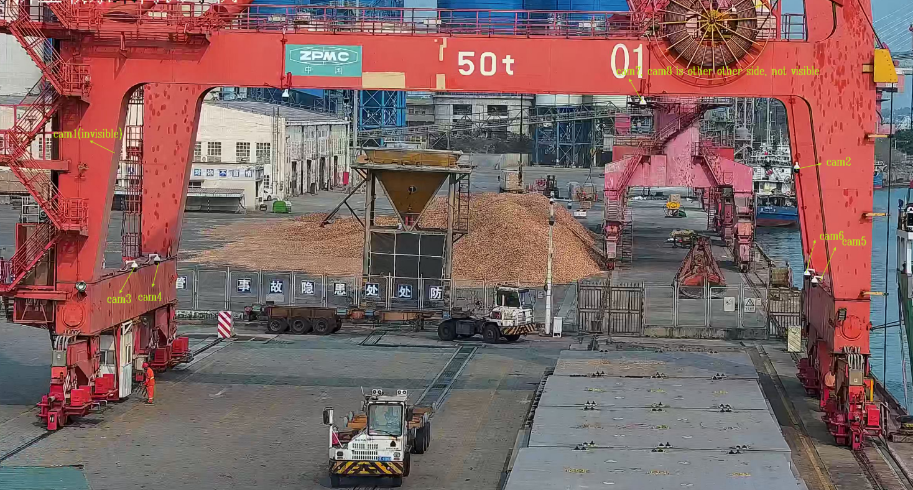


We use a two stage process to perform OCR on the images. The first stage is to detect the containers when the truck arrives at the target position. The second stage is to detect the containers when the container is hoisted. In the code we call these stages as mode 1 and mode 2 respectively.

The following images are used in the example usage:

- Mode 1 Images:
  - 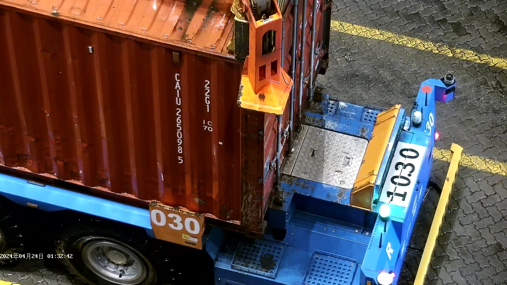
  - 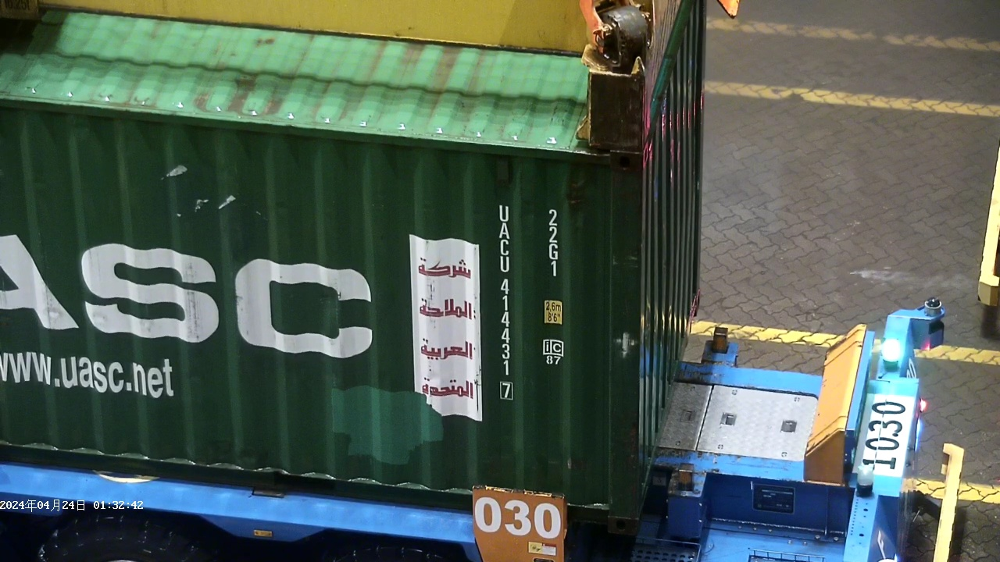
  - 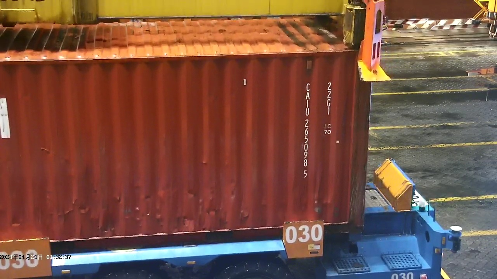
  - 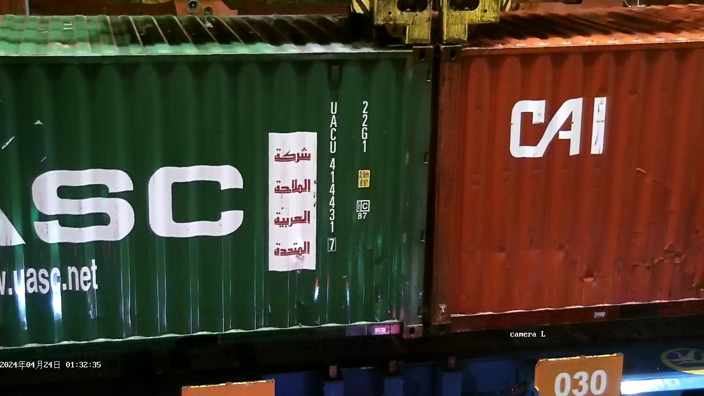
  - 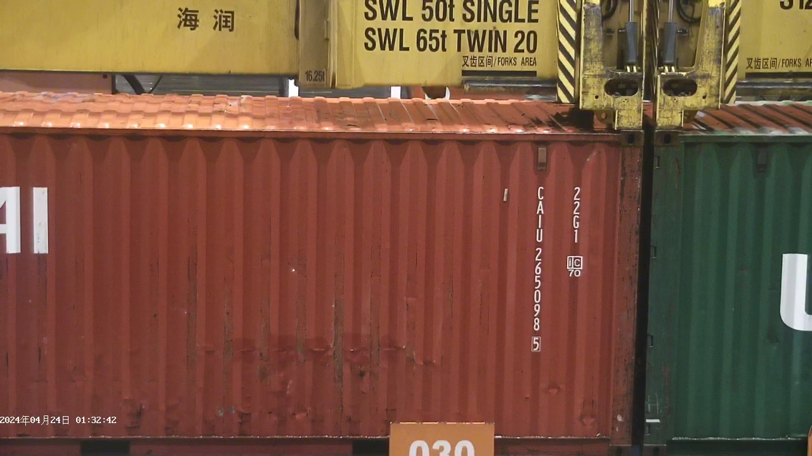
  - 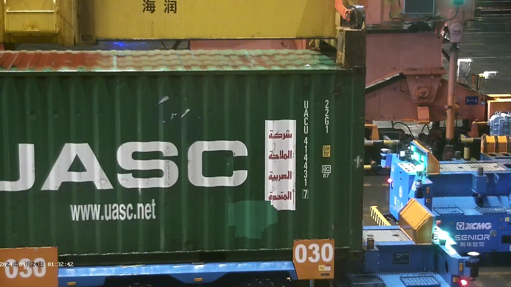

- Mode 2 Images:
  - 
  - 
  - 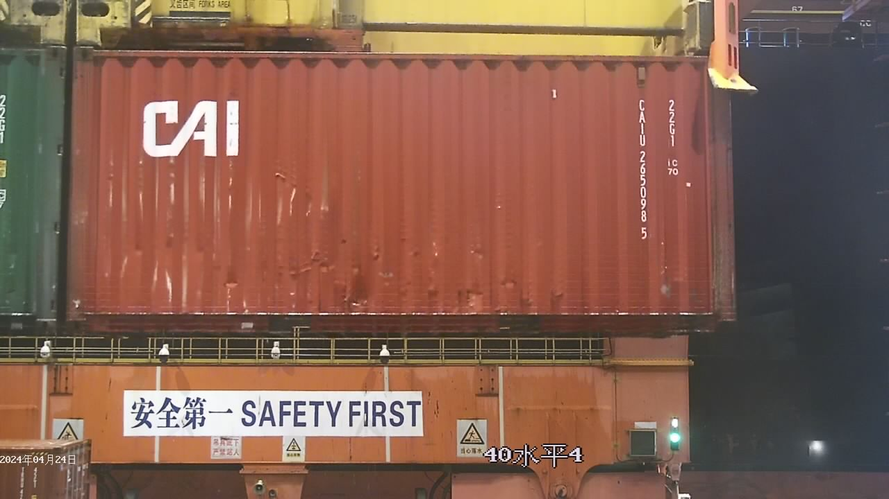
  - 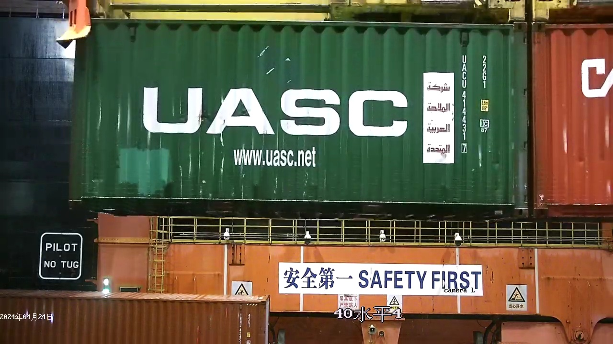
  - 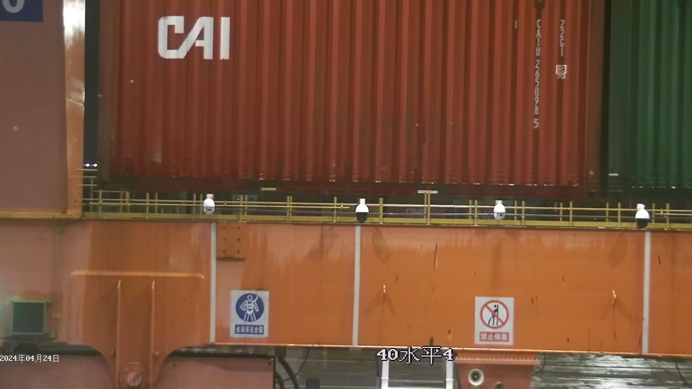
  - 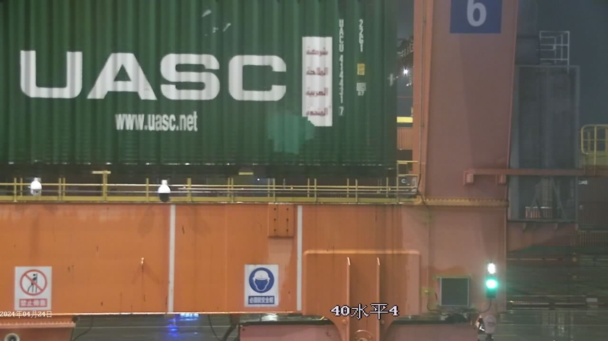
  - 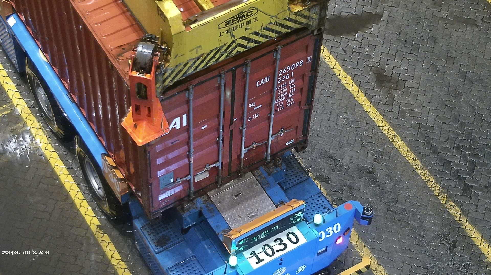
  - 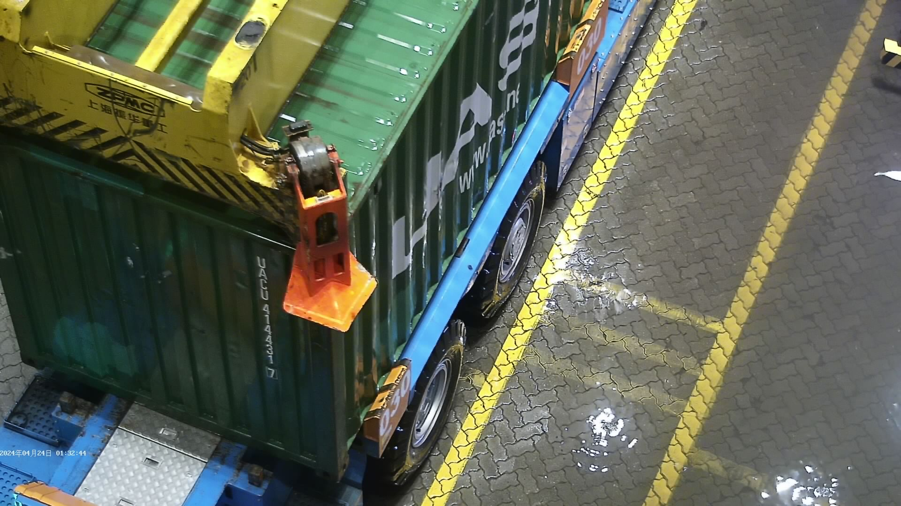


